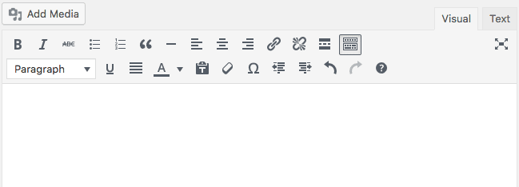

# Qué es HTML
HTML es el lenguaje para ````tratar```` los textos en la web. 
HTML: 
> Hyper Text Markup Language
El Lenguaje de Marcado de Hipertexto  ( HTML)
Nos encontramos por tanto, dos conceptos:

1. Hipertexto:  
__ **¡Los enlaces!**  vinculación de fragmentos textuales o gráficos a otros fragmentos. 

2. Lenguaje de Marcado: 
   HTML  es el código (de marcas) que se utiliza para estructurar y desplegar una página o documento web y sus contenidos. Por ejemplo, sus contenidos podrían ser párrafos, una lista con viñetas, tablas de datos  o imágenes. 

   - HTML es como un procesador de textos usado de forma  muy simple (word, writer...) en el que sobre un texto plano utilizamos unas marcas para presentar la información. Podemos hacer negritas, cursivas, encabezados... Hacemos lo mismo que con word pero en un lenguaje muy universal y que no necesita de un programa **cerrado** para ejecutarse (sólo un navegador web)
   - HTML hace al texto lo que los maestros hacían a los textos con indicaciones cuando nos hacían escribir *al dictado* de pequeños: ``Título`` 'El Tajo' ``entre comillas`` 'el río más largo de España'  ``punto y aparte``.  Al decirnos Título, nosotros escribíamos más grande, cuando nos decía punto y aparte, nosotros empezábamos a escribir en le renglón siguiente.


- HTML no es un lenguaje de programación. **¡Es mucho más  simple y más fácil!** es un **lenguaje de marcado** que define la estructura y jeraquía de tu contenido. HTML consiste en una serie de elementos que usarás para ``encerrar ``o ``acotar ``diferentes partes del contenido para que se vean o comporten de una determinada manera. Las etiquetas de ``delimitación`` pueden  cambiar palabras a cursiva, hacerla negrita, agrandar o achicar la letra, etc. y también hacer de una palabra o una imagen un hipervínculo a otro sitio (esto serían los hiperenlaces que generan el **Hipertexto**)

Por ejemplo, tomemos la siguiente línea de contenido:
````
Mi gato es muy gruñón
````
Si queremos especificar que se trata de un párrafo, podríamos encerrar el texto con la etiqueta de párrafo  (````<p>````) :

````
<p>Mi gato es muy gruñón</p>
````
Esto si lo viéramos a través de una navegador (a través de la web) como un párrafo. El navegador interpreta que es un párrafo.

Otro ejemplo sería:  si quisiéramos hacer una redacción sobre nuestras vacaciones empezaríamos con el título:  ``Mis vacaciones de verano``. En HTML se vería así
````
<h1>Mis vacaciones de verano</h1>
````
Si vemos el documento vía web, el h1 desaparecería y veríamos un texto grande en negrita

No es necesario asustarse con las marcas, las explicamos a modo de comprensión. Podemos escribir html como cuando escribimos en word  o en  editor de texto tipo WYSIWYG como [TinyMCE ](https://es.wikipedia.org/wiki/TinyMCE)



> El objetivo de timyMCE  es permitir crear código HTML sin necesidad de conocimientos del mismo, editando la información en "modo gráfico" y permitiendo tambien la edición directa del código HTML generado.


