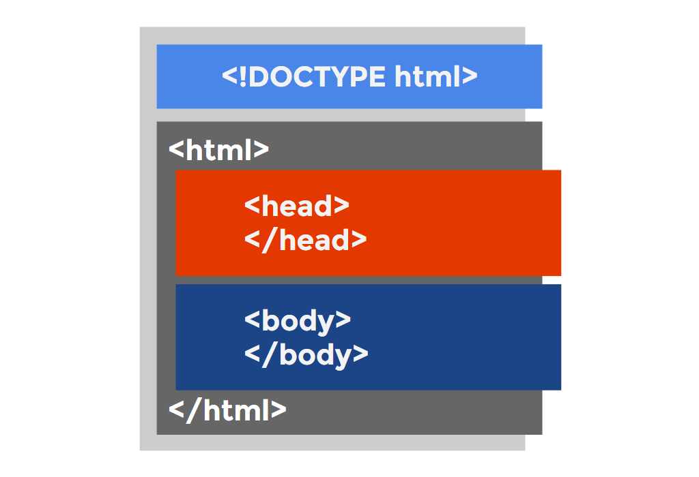

# Estructura de un documento html
Un documento HTML debe tener siempre una estructura inicial, con algunas etiquetas y características obligatorias y otras recomendables. Ese esquema es el siguiente, donde se diferencian tres elementos principales:


## Elemento html
El elemento HTML ````<html>```` (o elemento HTML raiz) representa la raiz de un documento HTML. El resto de elementos descienden de este elemento.
### Head:
 En el documento HTML hay una primer elemento donde se especificarán todos los metadatos del documento, es decir, la parte «que no se ve» directamente en el navegador de forma visual.

### Body:
representa el contenido de un documento HTML. Solo puede haber un elemento ````<body>```` en un documento..
### Tipo de documento:
 En la primera línea del documento HTML debe ir especificado siempre de que tipo de documento HTML se trata. No es absolutamente obligatorio indicarlo (de hecho, hay páginas webs que no lo tienen), pero eso trae algunas consecuencias que veremos más adelante.

Antes de comenzar un documento HTML, en su primera línea, es siempre conveniente indicar el tipo de documento a utilizar. Para indicar que se trata de un documento HTML5 colocaremos la siguiente linea:
````
<!DOCTYPE html>
````
En versiones anteriores, como HTML4 o XHTML, el tipo de documento se especificaba en la primera línea de la siguiente forma (más compleja):
````
<!DOCTYPE html PUBLIC "-//W3C//DTD XHTML 1.0 Strict//EN"
    "http://www.w3.org/TR/xhtml1/DTD/xhtml1-strict.dtd">
````
Los navegadores, antes de comenzar a dibujar una página web, lo primero que hacen es leer la línea donde se indica el tipo de documento del que se trata. De esta forma, el navegador ya está preparado para actuar adaptándose perfectamente a cada tipo de documento.

En el caso de no indicar el tipo de documento en una página HTML, el navegador entra en lo que se llama Quirk mode (modo peculiar o modo no estándar), donde se activa un modo de retrocompatibilidad con páginas antiguas, que procesará de forma diferente muchas etiquetas HTML o propiedades CSS.

