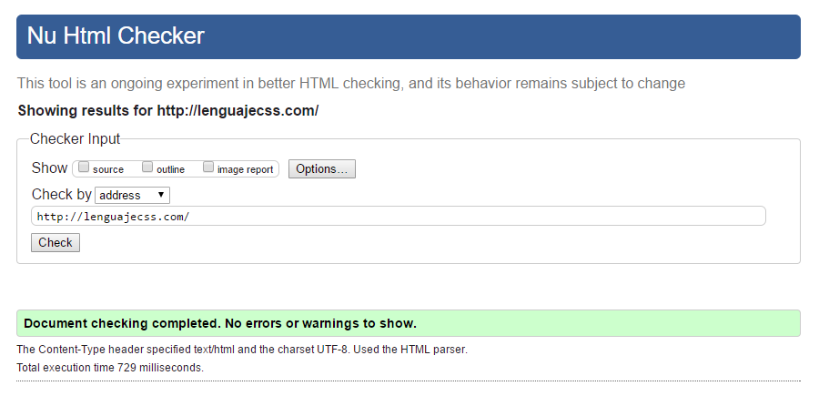

# Validación HTML
Si estamos empezando con nuestro primer documento HTML y queremos comprobar si hay errores o hemos hecho mal, ¿qué podemos hacer? Los programadores suelen estar acostumbrados a los lenguajes de programación, donde si tenemos un error en nuestro código, debemos corregirlo para continuar, ya que en caso contrario no podremos utilizar ese programa.

En los lenguajes de marcas como HTML, los navegadores son más permisivos, ya que en el caso de encontrar un error, intentan «intuir» lo que se quiso decir y prosiguen con la carga del documento. De esta forma tenemos un método más flexible a errores, pero también es un arma de doble filo donde podemos experimentar problemas derivado de ello.

## Validador HTML5 de W3C 
Para evitar esto y asegurarnos de que nuestro código está correctamente escrito, podemos utilizar un Validador HTML, que no es más que un sistema que analiza nuestro código y nos dice el número de errores que tenemos, junto a una breve descripción del mismo.

Para realizar ese proceso de validación podemos utilizar HTML Validator, de W3C, que contiene Nu HTML Checker, un validador de HTML5 aún en fase experimental, pero que actualmente puede ser utilizado sin problemas para este proceso de búsqueda de errores:

Nu HTML Checker, validador HTML5

Existen 3 formas de enviar nuestro documento HTML a este validador HTML:

* Address: Indicando la dirección URL de la página que se quiere validar. Obviamente, es necesario que la página esté colgada en Internet.

* File Upload: Seleccionando el archivo HTML de nuestro equipo, subirlo al validador y, posterior y finalmente, realizar el proceso de análisis.

* Text Input: Escribiendo (o pegando) directamente el código HTML del documento HTML íntegro a analizar.

Además, si nos fijamos en la parte superior de la herramienta de validación, veremos que hay tres casillas disponibles para marcar, con las que podemos agregar nuevas características que se mostrarán tras la validación. Dichas características son las siguientes:

* Source: Nos muestra el código fuente, numerado por líneas. Útil para corregir problemas sobre la marcha o comprobar los errores en las líneas especificadas.

* Outline: Nos muestra una especie de árbol o esquema de la página.

* Image report: Genera un informe de las imágenes del sitio web, con una miniatura y sus características asociadas.

Es una buena práctica acostumbrarse a utilizar el validador para acostumbrarse a crear código HTML de calidad y sin errores, ya que si tenemos documentos sin errores de validación, es más probable que se vean correctamente en cualquier tipo de dispositivo.

> En el editor VSCode podemos encontrar el paquete w3c-validation, que nos permite analizar los documentos HTML directamente desde el editor.