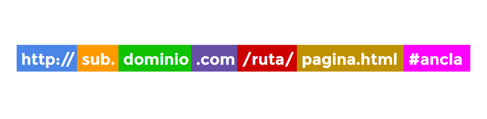

# URLs y rutas
Para comprender completamente a dónde apuntan los enlaces,  o cómo incorporar una imagen a un documento html, o cualquier tipo de contenido externo  necesitas conocer las URLs y las rutas. 

Una **localizadora uniforme de recursos** (URL, de las iniciales en inglés de «Uniform Resource Locator») es simplemente una secuencia de caracteres de texto que definen donde está situado algo en la web. Por ejemplo, la página de Mozilla está ubicada en https://www.mozilla.org/es-ES/.

Las URLs utilizan rutas para encontrar los archivos. Las **rutas** especifican **dónde se encuentra el archivo** que buscas dentro del sistema de archivos. 

## Esquema de una URL 
Al indicarse una URL, tenemos varias formas de escribirla. Conviene conocer bien la estructura de una URL, para diferenciar cada una de sus partes. Este sería el esquema completo de un enlace completo:

Estructura de una URL sin query-strings

### Protocolo 
Existen varios protocolos diferentes y es la parte inicial de la URL. Probablemente, el más utilizado sea http://, aunque https:// también es frecuentemente muy utilizado, ya que se utiliza para cifrar información y que la transmisión sea más segura. Al escribir una URL nunca debemos olvidarnos del protocolo y escribir sólamente la dirección, ya que el vínculo podría no funcionar correctamente. Algunos protocolos de ejemplo:


* http://	Protocolo de transferencia de hipertexto. Es el que se usa habitualmente para páginas webs.
* https://	Protocolo seguro de transferencia de hipertexto. Usado para cifrar información sensible.
* ftp://	Protocolo de transferencia de ficheros. Similar a HTTP, pero orientado a enviar ficheros.
* //	Protocolo utilizado en la URL actual. Utiliza http o https según la página original.

Un detalle importante sobre la última opción de la tabla anterior. Al indicar // al inicio de un enlace, le decimos al navegador que establezca http:// o https:// dependiendo de como se cargara el documento actual. Si el documento actual se cargó como http:// reemplazará // por http://, pero si el documento actual se cargó como https:// reemplazará // por https://. Esto nos permite más flexibilidad a la hora de cargar documentos o recursos.

## Dominio 
La siguiente parte de la URL es el dominio del sitio web que queremos enlazar. El dominio generalmente se compone de un subdominio (opcional), el nombre de dominio y el dominio de nivel superior o TLD. 
Por ejemplo, las famosas www no son más que un subdominio utilizado tradicionalmente para páginas webs. Por otra parte, hay muchísimos TLD para sitios web:


* .com	Originalmente para sitios comerciales, actualmente el más utilizado. Difícil conseguir dominio libre.
* .net	Quizás, la segunda opción por excelencia. Su nombre proviene de la palabra Internet.
* .org	Originalmente para organizaciones, actualmente es la tercera opción más utilizada.
* .es	Sitios webs orientados a España.
* .com.es	Dominio de segundo nivel orientado a España.
* .cat	Sitios webs orientados a Cataluña. Muy usado para sitios webs de gatos.
* .la	Sitios webs orientados a Laos. Muy usado para domain-hacks.
* .me	Sitios webs orietnados a Montenegro. Muy usado para domain-hacks.
* .io	Sitios webs orientados al Territorio Británico de Océano Índico. Muy usado como Input/Output.
* .dev	Sitios webs orientados al mundo del desarrollo o programación (developers).
* .blog	Nuevos gTLD (dominios genéricos) orientados a categorías. En este caso, a blogs.
* .viajes	Nuevos gTLD (dominios genéricos) orientados a categorías. En este caso, a webs sobre viajes.

## Rutas: 
La parte de la ruta de una página web es equivalente a las carpetas o directorios donde almacenamos nuestros archivos. En el caso que una dirección termine en esta parte y no indique nada más, generalmente, el servidor que aloja la página web dirige al usuario a una página llamada index.html o index.htm por defecto. Esto es configurable en la parte del servidor, y depende de totalmente de la configuración del servidor web utilizado.

##  Página o documento: 
La última parte de la URL suele ser un documento HTML como el del ejemplo: pagina.html. En algunos casos, la extensión .html es abreviada como .htm. Dependiendo del servidor web y los componentes instalados, es posible que se utilicen otro tipo de documentos con lenguajes de programación del lado del servidor, como podría ser por ejemplo pagina.php. Si se trata de otro documento, como un archivo PDF o un video, el navegador intentará abrirlo directamente, y si no puede, lo descargará para que el usuario lo abra con alguna aplicación de su sistema.

## Query strings:
 Una parte no mencionada en el esquema anterior son las cadenas de consulta del usuario, más frecuentemente utilizadas en lenguajes como Javascript o lenguajes del servidor. Básicamente, son variables que contienen información y se envían en la URL, como por ejemplo, en la búsqueda de Google:

URL	Variable	Contenido	Significado
https://www.google.com/search?q=gato	q	gato	Busca "gato"
https://www.google.es/search?q=gato&tbm=isch	q	gato	Busca "gato"
tbm	isch	En Google Imágenes

# Ancla: Enlaces internos
Por último tenemos el ancla, que no es más que un fragmento de texto precedido por el carácter #. Al encontrarse con esto, el navegador busca una etiqueta HTML que tenga un atributo id con ese texto, y posiciona al usuario en esa parte de la página. Se utiliza para acceder directamente a permalinks o secciones concretas de una página. Obviamente, esta parte es opcional.

Recientemente también ha parecido una nueva característica llamada scroll to text fragments. Se basa en escribir el texto ```` #:~:text=<palabrainicial>,<palabrafinal>```` a continuación de la URL. Con esto, el navegador hace scroll a la parte de la página donde se encuentra el fragmento de texto que comienza por la palabra inicial y termina por la palabra final. También se pueden indicar frases en lugar de palabras.


## Rutas relativas o absolutas 
A la hora de indicar una URL, generalmente se puede hacer de varias formas:

* Sin ruta	imagen.jpg	En la misma carpeta del .html actual.
* Relativa ascendente	img/imagen.jpg	En la carpeta img de la carpeta actual.
* Relativa descendente	../imagen.jpg	En la carpeta anterior a la actual. 
* Relativa global	/img/imagen.jpg	El primer / simboliza el principio de la URL.
* Absoluta	https://pagina.com/img/imagen.jpg	Exactamente en la URL indicada.

